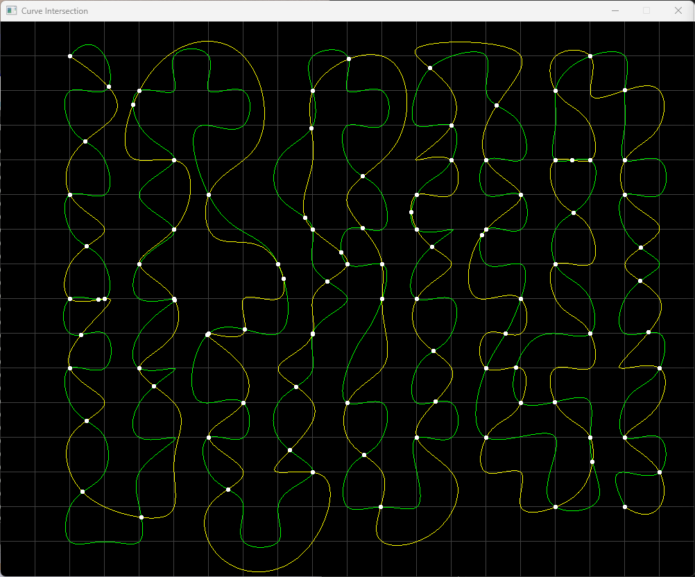

# Intersection algorithm for two B-spline curves using Bezier clipping

## Find intersection points between two B-spline curves

- Find intersection between one of (point, line, or curve) and one of (point, line, or curve)
- Each iteration info saved in node_info.log file
- Verbose info optionally saved in calc.log file
- m = n + p + 1 should be satisfied for a curve
(m: knot vector [u_0, u_m], n: control points [P_0, P_n], p: degree of a curve)

## How to use

### Interpolation mode
- A curve is supposed to pass through the selected points.
- Global interpolation is used. A curve becomes distorted as the degree of a curve is elevated.
- The same point cannot be selected successively, which causes an LU decomposition failure.
- The minimum number of interpolation points to make a curve is degree + 2.

### Control points mode
- With the interpolation mode off, the selected points are control points of a curve.
- The minimum number of control points to make a curve is degree + 1.
- A point can be created by selecting the same point at least degree + 1 times.

## Limitation

- Not for self intersection

## Development Tools

- Microsoft Visual Studio Community 2022 (64-bit) - 
Version 17.9.0 Preview 1.0
C++latest(modules)

## Library via vcpkg

- sfml 2.6.1
- imgui 1.90
- imgui-sfml 2.6
- magic-enum 0.9.5

## Sample calculation

